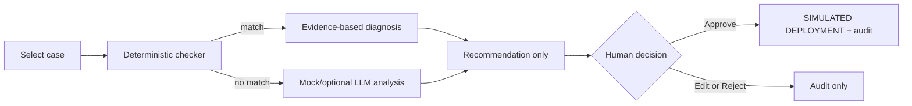

# Diagnostic Flow

```mermaid
flowchart LR
 A[Select case] --> B[Deterministic checker]
 B -->|match| C[Evidence-based diagnosis]
 B -->|no match| D[Mock/optional LLM analysis]
 C --> E[Recommendation only]
 D --> E
 E --> F{Human decision}
 F -->|Approve| G[SIMULATED DEPLOYMENT + audit]
 F -->|Edit or Reject| H[Audit only]
```
